# Bluemoon CTF Write-up

## Objective

The goal of this challenge was to gain **root access** to the Bluemoon machine by identifying vulnerabilities and escalating privileges.

---

## 1. Finding Target IP

The first step was to identify the target machine on the network.

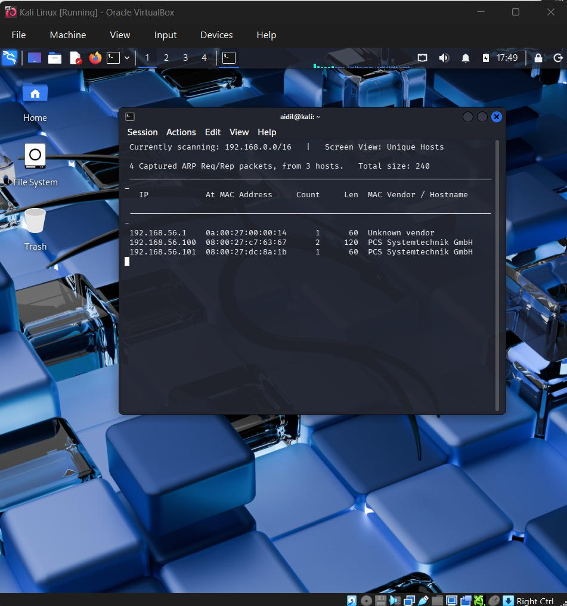

This revealed the IP address of the Bluemoon machine.

---

## 2. Nmap Scan

A network scan was performed using Nmap to identify open ports and services.

```
nmap -sC -sV 192.168.56.101
```

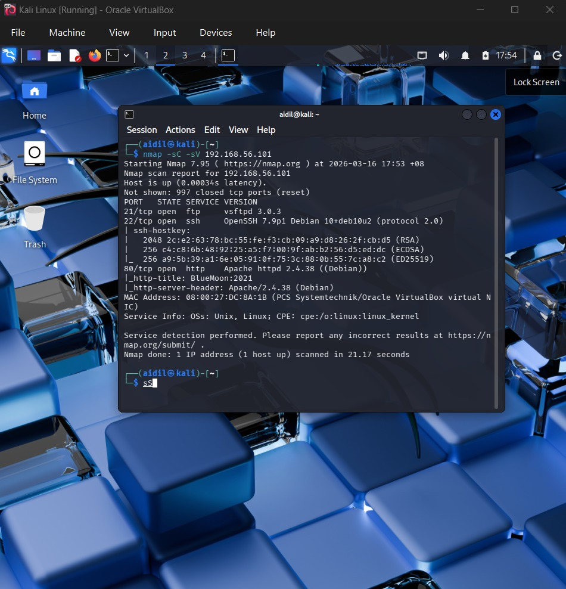

This provided useful information about available services for further enumeration.

---

## 3. Enumeration

Initial enumeration of the web server was performed using Gobuster to discover hidden directories.

```
gobuster dir -u http://192.168.56.101 -w /usr/share/wordlists/dirb/common.txt
```

This revealed several directories that could contain useful information for further exploitation.

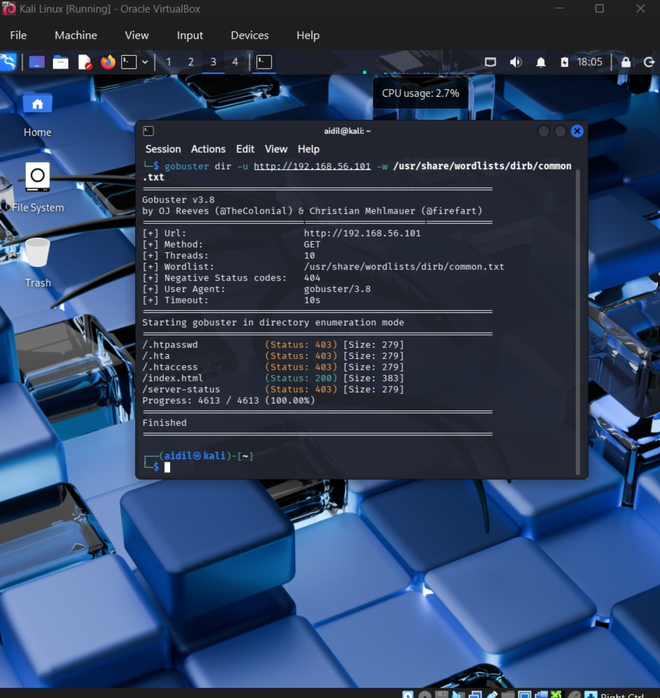

---

## 4. Game Begins

The target web application was accessed using a browser:

http://192.168.56.101

Upon visiting the page in Firefox, a message indicating the start of the challenge was displayed.

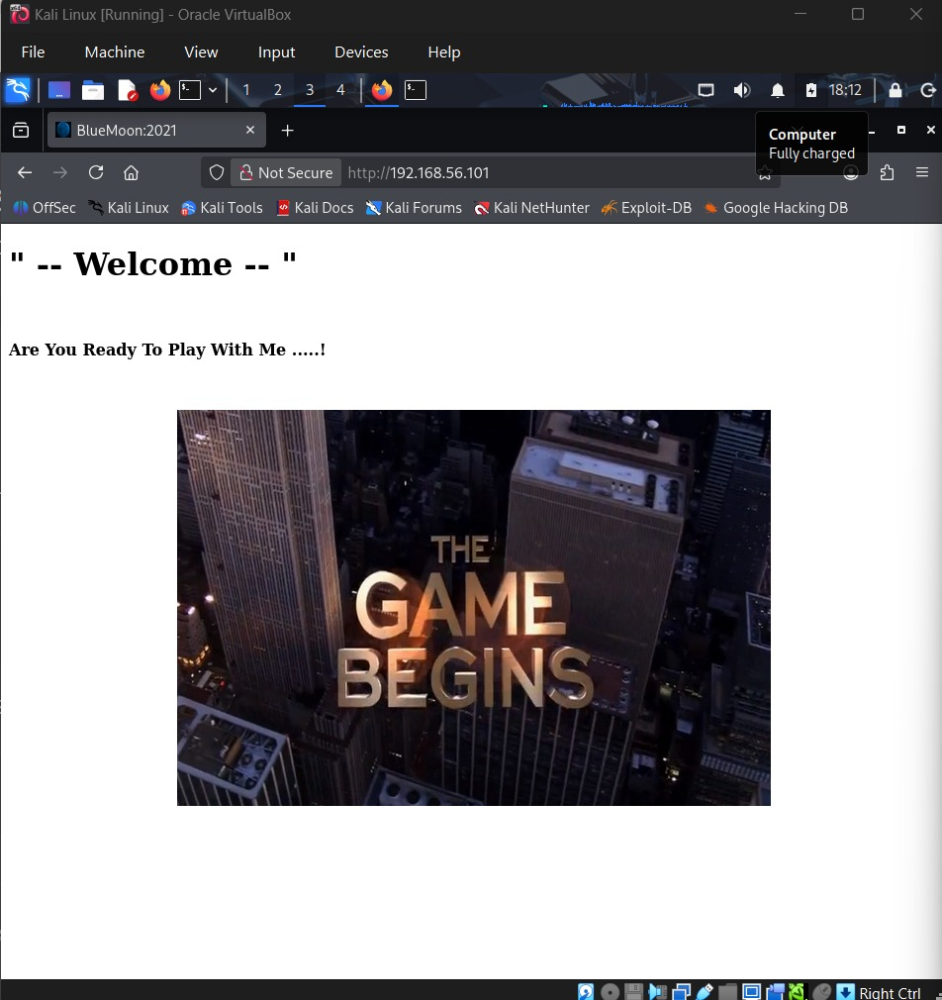

This confirmed that the web application is the primary entry point and further analysis was required.

---

## 5. Source Code Inspection

The page source code was inspected to uncover hidden information.

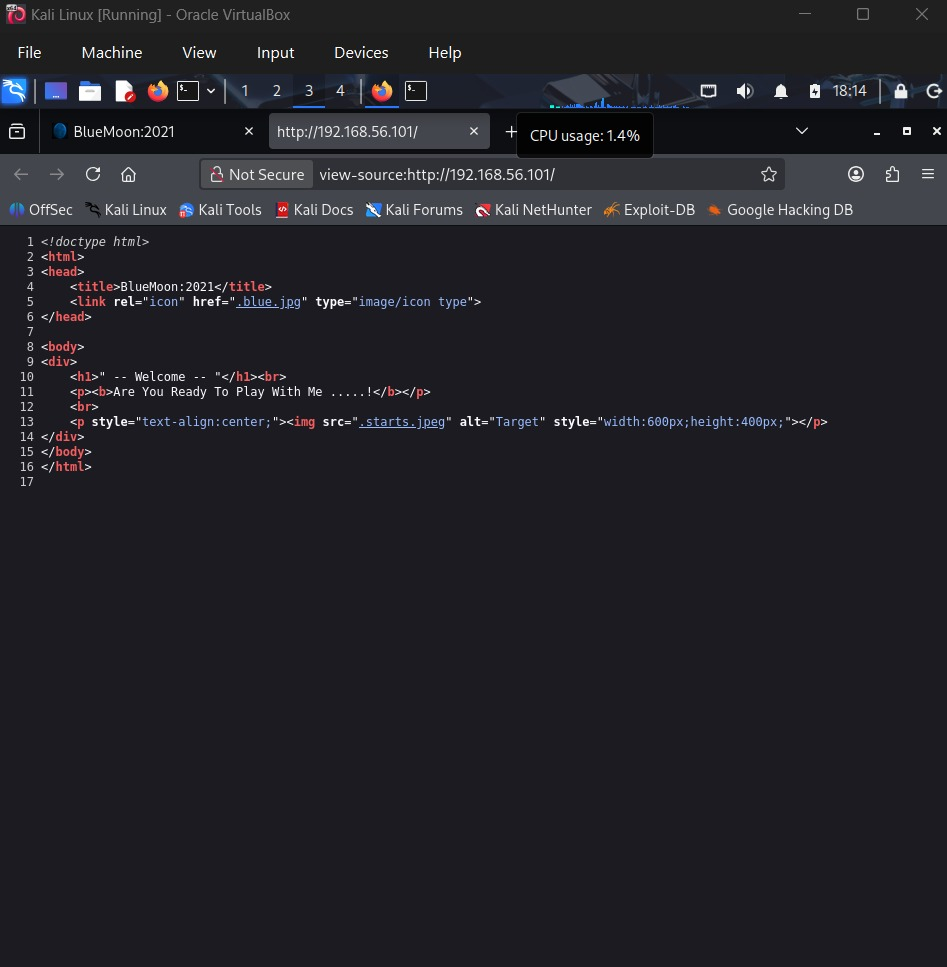

This revealed useful hints that guided further exploitation.

---

## 6. Bluemoon Page

Further navigation led to the Bluemoon page.

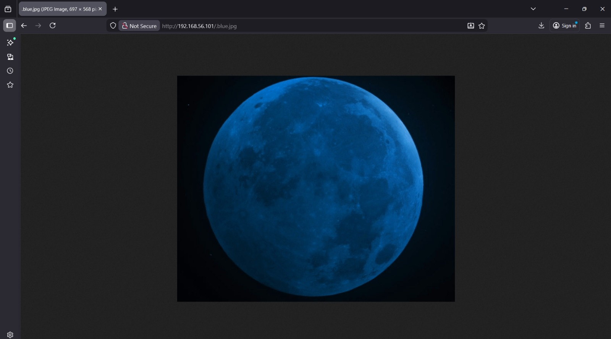

This page provided additional context for the challenge.

---

## 7. Credential Discovery

During enumeration, a password list was discovered that contained possible credentials.

This information was used to attempt authentication on the system.

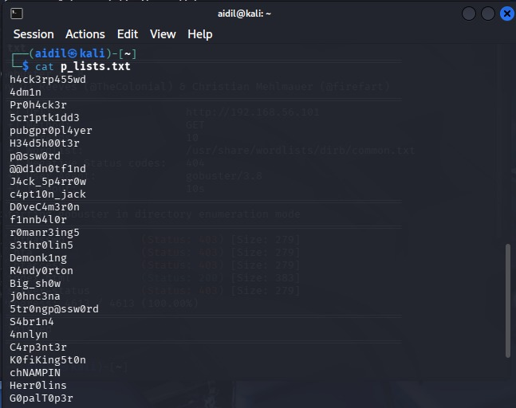

---

## 8. Login as Robin

Using the discovered credentials, access to the system was obtained as the user **robin**.

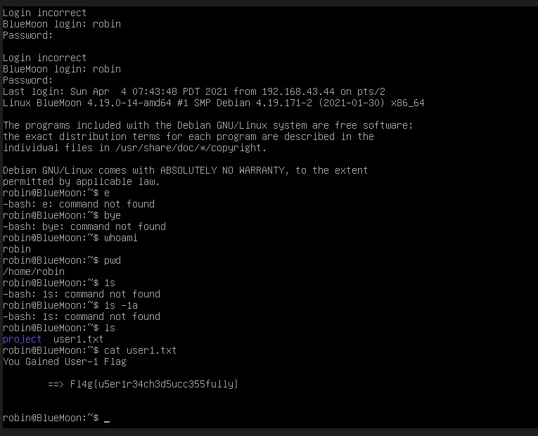

---

## 9. Privilege Escalation to Jerry

Further analysis revealed a script (`feedback.sh`) that could be executed with elevated permissions.

```
sudo -u jerry ./feedback.sh
```

This allowed command execution as the user **jerry**.

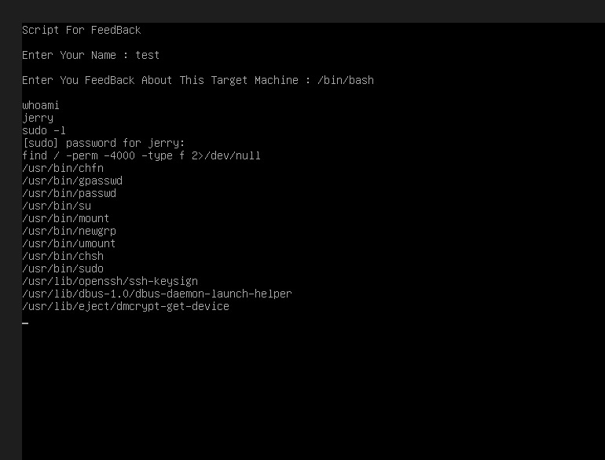

---

## 10. Docker Privilege Escalation

The user **jerry** was found to belong to the **docker group**, which allows interaction with Docker containers.

```
docker run -v /:/mnt -it alpine sh
```

This command mounts the host filesystem into the container.

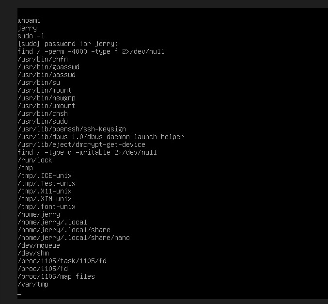

---

## 11. Accessing the Host Filesystem

Inside the container, the host filesystem became accessible via `/mnt`.

```
cd /mnt/root
```

This allowed access to sensitive files on the host system.

---

## 12. Root Flag

Finally, the root flag was retrieved:

```
cat root.txt
```

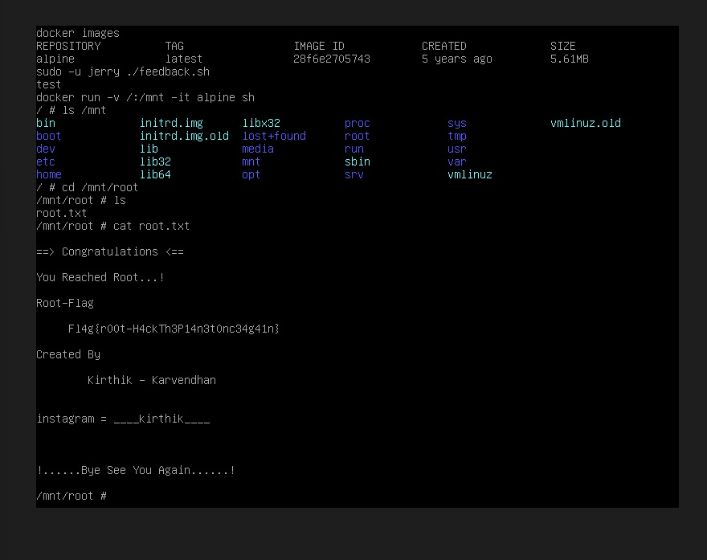

This confirms **full root access** to the machine.

---

## Conclusion

This challenge demonstrated several important penetration testing concepts:

* Network scanning (Nmap)
* Web directory enumeration
* Credential discovery
* Privilege escalation using sudo
* Docker privilege escalation
* Accessing the host filesystem

By chaining these vulnerabilities together, complete compromise of the system was achieved.
