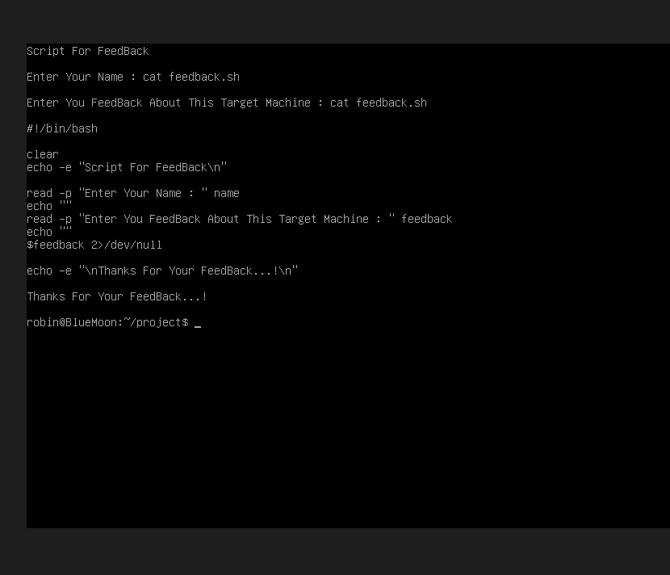

# Bluemoon CTF Write-up

## Objective

The goal of this challenge was to obtain **root access** on the Bluemoon machine by identifying and exploiting system vulnerabilities.

---

# 1. Enumeration

The first step was to enumerate the target machine to discover accessible directories.

**Gobuster** was used to perform directory brute-forcing:

```
gobuster dir -u http://192.168.56.101 -w /usr/share/wordlists/dirb/common.txt
```

This revealed several directories that could potentially contain vulnerable functionality.


---

# 2. Command Injection

During analysis, a script named **feedback.sh** was discovered.
This script allowed command execution when run with elevated permissions.

```
sudo -u jerry ./feedback.sh
```

Testing simple commands confirmed command injection was possible:

```
whoami
id
```

The output showed that the user **jerry** belonged to the **docker** group.



---

# 3. Docker Privilege Escalation

Because the user **jerry** was part of the docker group, it was possible to start a container with access to the host filesystem.

The following command was used:

```
docker run -v /:/mnt -it alpine sh
```

This mounts the host root directory `/` into the container at `/mnt`.


---

# 4. Accessing Host Filesystem

Inside the container, the host filesystem became accessible through `/mnt`.

```
ls /mnt
```

The root user's home directory was accessed with:

```
cd /mnt/root
```


---

# 5. Root Flag

Finally, the root flag was obtained:

```
cat root.txt
```

This confirmed **full root access** to the Bluemoon machine.


---

# Conclusion

This challenge demonstrated several important penetration testing concepts:

* Web directory enumeration
* Command injection exploitation
* Privilege escalation through Docker group membership
* Host filesystem access through container mounts

By chaining these vulnerabilities together, full **root compromise** of the target system was achieved.
